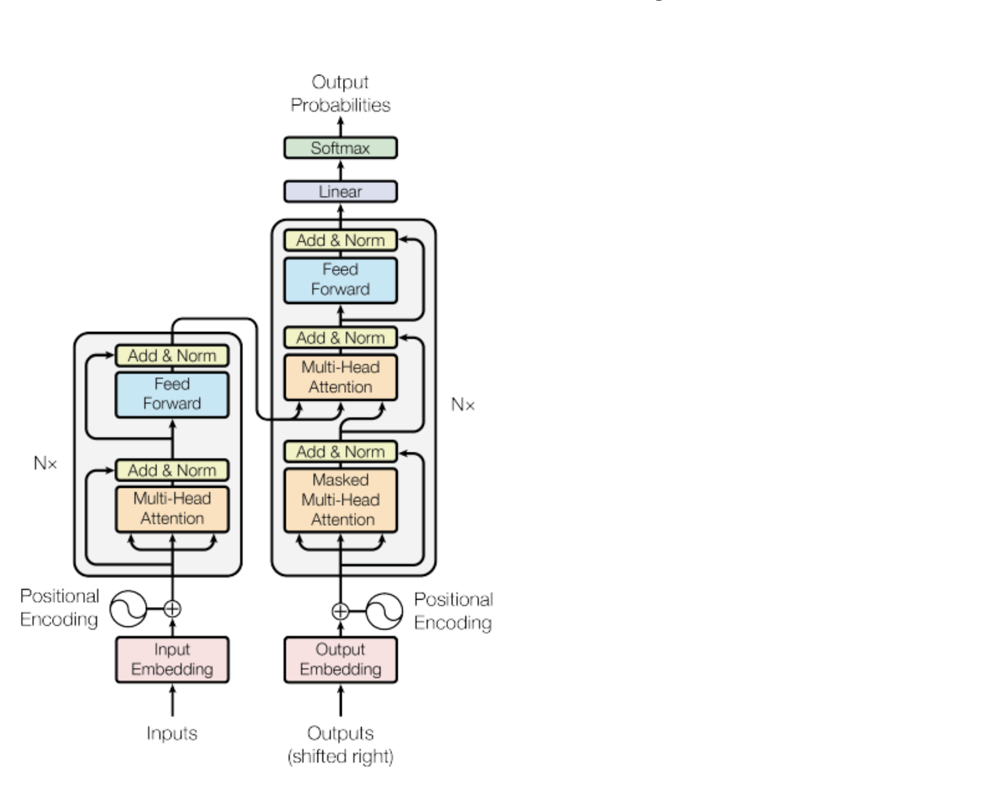

# Week 1

"[Foundation models](https://en.wikipedia.org/wiki/Foundation_models)" or "Base" models

- BERT
- GPT
- LLaMa
- FLAN-T5
- BLOOM
- PaLM

**Context window**: the space or memory available to an LLM prompt.

The output of an LLM is a **completion**. The output consists of the original prompt and
the generated text of the model.

**Inference**: the act of using an LLM to generate text.

---

LLM use cases and tasks

**Prediction** is a base concept underlying a variety of text generation tasks:

- Write an essay based on a prompt
- Summarize conversations provided as part of the prompt
- Translation between languages (e.g. French, German, etc)
- Translate natural language to machine code
- Information retrieval (e.g. "named entity recognition")

An area of active research is augmenting LLM's with the ability to interact with external
data sources and API's.

---

Previous to LLM's, RNN's were used for generative texts tasks but with poorer results and
much larger memory and processing requirements.

---

> The power of the transformer architecture lies in its ability to learn the relevance and
context of all of the words in a sentence. Not just as you see here, to each word next to
its neighbor, but to _every other word in a sentence_. To apply attention weights to
those relationships so that the model learns the relevance of each word to each other
words no matter where they are in the input.

An **attention map**.

[Self-attention](https://en.wikipedia.org/wiki/Self-attention) weights are also called
"heads".

During model training, the weights of each head are randomly initialized and given
sufficient training data and time, each head will learn a different aspect of language.

---

Transformers: Attention is all you need

"Attention is All You Need" is a research paper published in 2017 by Google researchers, which introduced the Transformer model, a novel architecture that revolutionized the field of natural language processing (NLP) and became the basis for the LLMs we  now know - such as GPT, PaLM and others. The paper proposes a neural network architecture that replaces traditional recurrent neural networks (RNNs) and convolutional neural networks (CNNs) with an entirely attention-based mechanism.

The Transformer model uses self-attention to compute representations of input sequences, which allows it to capture long-term dependencies and parallelize computation effectively. The authors demonstrate that their model achieves state-of-the-art performance on several machine translation tasks and outperform previous models that rely on RNNs or CNNs.

The Transformer architecture consists of an encoder and a decoder, each of which is composed of several layers. Each layer consists of two sub-layers: a multi-head self-attention mechanism and a feed-forward neural network. The multi-head self-attention mechanism allows the model to attend to different parts of the input sequence, while the feed-forward network applies a point-wise fully connected layer to each position separately and identically.

The Transformer model also uses residual connections and layer normalization to facilitate training and prevent overfitting. In addition, the authors introduce a positional encoding scheme that encodes the position of each token in the input sequence, enabling the model to capture the order of the sequence without the need for recurrent or convolutional operations.

[Original paper](supplemental/attention-is-all-you-need.pdf)

---

The work to develop and improve prompts to get the model to behave in a desired way is
**prompt engineering**.

A powerful strategy to get the model to produce better outcomes is to include examples
of the task you want the model to carry out inside the prompt aka context window. This
is called **in-context learning**.

The method of including your input data within a prompt is called **zero-shot** inference.

The inclusion of a single example is known as **one-shot** inference.

By extension, the inclusion of more than 1 example is known as **few-shot** inference.

**Fine-tuning** a model performs additional training on the model using new data to make
it more capable of the task you want it to perform.

---

Generative configuration **inference-time** parameters (in contrast with training-time
parameters)

Greedy decoding - simplest form of next-word prediction where model chooses word with
highest probability.

Random sampling - choose next output word at random using the probability distribution
to weight selections.

Max new tokens - a limit to the maximum number of tokens the model will generate

Sampling technique to help limit random sampling and increase chances
model output is sensible:

- Top K - model only chooses from k tokens with highest probability
- top P - limit sampling to predictions whose combined probabilities do not exceed p

Temperature - parameter within model output softmax layer used to increase or decrease
randomness. Lower temperature results in reduced variability while a higher temperature
results in increased randomness of the output.

---

