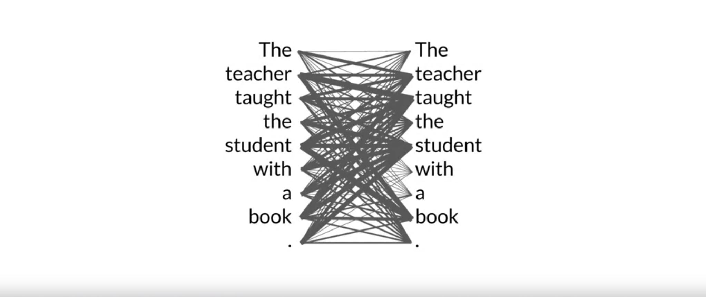

# Week 1

"[Foundation models](https://en.wikipedia.org/wiki/Foundation_models)" or "Base" models

- BERT
- GPT
- LLaMa
- FLAN-T5
- BLOOM
- PaLM

**Context window**: the space or memory available to an LLM prompt.

The output of an LLM is a **completion**. The output consists of the original prompt and
the generated text of the model.

**Inference**: the act of using an LLM to generate text.

---

LLM use cases and tasks

**Prediction** is a base concept underlying a variety of text generation tasks:

- Write an essay based on a prompt
- Summarize conversations provided as part of the prompt
- Translation between languages (e.g. French, German, etc)
- Translate natural language to machine code
- Information retrieval (e.g. "named entity recognition")

An area of active research is augmenting LLM's with the ability to interact with external
data sources and API's.

---

Previous to LLM's, RNN's were used for generative texts tasks but with poorer results and
much larger memory and processing requirements.

---

> The power of the transformer architecture lies in its ability to learn the relevance and
context of all of the words in a sentence. Not just as you see here, to each word next to
its neighbor, but to _every other word in a sentence_. To apply attention weights to
those relationships so that the model learns the relevance of each word to each other
words no matter where they are in the input.

An **attention map**.

[Self-attention](https://en.wikipedia.org/wiki/Self-attention) weights are also called
"heads".

During model training, the weights of each head are randomly initialized and given
sufficient training data and time, each head will learn a different aspect of language.

---

Transformers: Attention is all you need

"Attention is All You Need" is a research paper published in 2017 by Google researchers, which introduced the Transformer model, a novel architecture that revolutionized the field of natural language processing (NLP) and became the basis for the LLMs we  now know - such as GPT, PaLM and others. The paper proposes a neural network architecture that replaces traditional recurrent neural networks (RNNs) and convolutional neural networks (CNNs) with an entirely attention-based mechanism.

The Transformer model uses self-attention to compute representations of input sequences, which allows it to capture long-term dependencies and parallelize computation effectively. The authors demonstrate that their model achieves state-of-the-art performance on several machine translation tasks and outperform previous models that rely on RNNs or CNNs.

The Transformer architecture consists of an encoder and a decoder, each of which is composed of several layers. Each layer consists of two sub-layers: a multi-head self-attention mechanism and a feed-forward neural network. The multi-head self-attention mechanism allows the model to attend to different parts of the input sequence, while the feed-forward network applies a point-wise fully connected layer to each position separately and identically.

The Transformer model also uses residual connections and layer normalization to facilitate training and prevent overfitting. In addition, the authors introduce a positional encoding scheme that encodes the position of each token in the input sequence, enabling the model to capture the order of the sequence without the need for recurrent or convolutional operations.

[Original paper](supplemental/attention-is-all-you-need.pdf)

---

The work to develop and improve prompts to get the model to behave in a desired way is
**prompt engineering**.

A powerful strategy to get the model to produce better outcomes is to include examples
of the task you want the model to carry out inside the prompt aka context window. This
is called **in-context learning**.

The method of including your input data within a prompt is called **zero-shot** inference.

The inclusion of a single example is known as **one-shot** inference.

By extension, the inclusion of more than 1 example is known as **few-shot** inference.

**Fine-tuning** a model performs additional training on the model using new data to make
it more capable of the task you want it to perform.

---

Generative configuration **inference-time** parameters (in contrast with training-time
parameters)

Greedy decoding - simplest form of next-word prediction where model chooses word with
highest probability.

Random sampling - choose next output word at random using the probability distribution
to weight selections.

Max new tokens - a limit to the maximum number of tokens the model will generate

Sampling technique to help limit random sampling and increase chances
model output is sensible:

- Top K - model only chooses from k tokens with highest probability
- top P - limit sampling to predictions whose combined probabilities do not exceed p

Temperature - parameter within model output softmax layer used to increase or decrease
randomness. Lower temperature results in reduced variability while a higher temperature
results in increased randomness of the output.

---

During pre-training the unstructured corpora of text is passed through a data quality
filter and it is common for only 1-3% of the original tokens to be used in the model.

## Three main Transformer model types

### 1. Encoder Only models (autoencoding models)

Pre-trained using Masked Language Modeling (MLM)

Use cases:
  - sentiment analysis
  - named entity recognition
  - word classification

Examples:
  - BERT
  - ROBERTA

### 2. Decoder Only models (autoregressive models)

Pre-trained using Causal Language Modeling (CLM)

Use cases:
  - Text generation
  - Other emergent behavior (dependent on model size)

Examples:
  - GPT
  - BLOOM

### 3. Encoder Decoders models (sequence-to-sequence models)

Pre-trained using a variety of techniques depending on use case.

The T5 model for example is trained using Span Corruption.

Use cases:
  - Translation
  - Text summarization
  - Question answering

Examples:
  - T5
  - BART

---

[Computational challenges of training LLMs](supplemental/computational-challenges-of-training-llms.mp4)

Approximate GPU RAM needed to store 1B parameters (weights)

- 1 parameter = 4 bytes (32-bit float)
- 1B parameters = 4 x 10$^9$ bytes = 4 GB

Additional GPU RAM needed for training

- Adam optimizer (2 states) = 8 bytes per parameter
- Gradients = 4 bytes per parameter
- Activations and temp memory = 8 bytes per parameter

An approximate estimate is that if 4 GB of GPU RAM is needed to _store_ the model, 20
times the amount of GPU memory (or 80 GB at 32-bit full precision) is needed to _train_
the model.

80 GB is the memory capacity of a single [NVIDIA A100](./supplemental/nvidia-a100-datasheet.pdf) GPU.

Techniques that can be used for reducing the required memory requirements

**Quantization**: reducing weight precision from 32-bit floating points to a lower
precision such as 16-bit floating point or 8-bit integer.

[Quantization aware training](https://www.tensorflow.org/model_optimization/guide/quantization/training) learns the quantization scaling factors during training.

[BFLOAT16](https://en.wikipedia.org/wiki/Bfloat16_floating-point_format) has become a
popular choice of precision in deep learning as it maintains the dynamic range of FP32,
but reduces the memory footprint by half.

**Fine-tuning** also requires storing all training parameters in memory.

---

Remember, the goal during pre-training is to maximize the model's performance of its learning
objective, which is minimizing the loss when predicting tokens.

Two options for better performance:

1. Increase the dataset size (number of tokens)
2. Increase the model size (number of parameters)

Compute budget for training LLMs

1 petaFLOP = 1_000_000_000_000_000 = 10$^15$ = 1 quadrillion floating point operations

**Petaflops/s-day**: number of floating point operations performed at a rate of 1 petaFLOP per
second for one day

1 petaflop/s-day is roughly equivalent to **8 NVIDIA V100** or **2 NVIDIA A100** GPU's running at
full efficiency for 1 day

One important takeaway from the [Chinchilla paper](supplemental/training-compute-optimal-large-language-models.pdf)
is that the optimal training dataset size for a given model is about 20 times larger than the
number of parameters in the model.

---

[Scaling Laws for Neural Language Models](supplemental/scaling-laws-for-neural-language-models.pdf)
follow a [power law](https://en.wikipedia.org/wiki/Power_law).

To scale our model, we need to jointly increase dataset size and model size, or they can become a
bottleneck for each other.

## Transformer Architecture

- [Attention is All You Need](https://arxiv.org/pdf/1706.03762) - This paper introduced the Transformer architecture, with the core “self-attention” mechanism. This article was the foundation for LLMs.
- [BLOOM: BigScience 176B Model](https://arxiv.org/abs/2211.05100) - BLOOM is a open-source LLM with 176B parameters (similar to GPT-4) trained in an open and transparent way. In this paper, the authors present a detailed discussion of the dataset and process used to train the model. You can also see a high-level overview of the model [here](https://bigscience.notion.site/BLOOM-BigScience-176B-Model-ad073ca07cdf479398d5f95d88e218c4).
- [Vector Space Models](https://www.coursera.org/learn/classification-vector-spaces-in-nlp/home/week/3) - Series of lessons from DeepLearning.AI's Natural Language Processing specialization discussing the basics of vector space models and their use in language modeling.

## Pre-training and scaling laws

- [Scaling Laws for Neural Language Models](https://arxiv.org/abs/2001.08361) - empirical study by researchers at OpenAI exploring the scaling laws for large language models.

## Model architectures and pre-training objectives

- [What Language Model Architecture and Pretraining Objective Work Best for Zero-Shot Generalization?](https://arxiv.org/pdf/2204.05832.pdf) - The paper examines modeling choices in large pre-trained language models and identifies the optimal approach for zero-shot generalization.
- [HuggingFace Tasks](https://huggingface.co/tasks) and [Model Hub](https://huggingface.co/models) - Collection of resources to tackle varying machine learning tasks using the HuggingFace library.
- [LLaMA: Open and Efficient Foundation Language Models](https://arxiv.org/pdf/2302.13971.pdf) - Article from Meta AI proposing Efficient LLMs (their model with 13B parameters outperform GPT3 with 175B parameters on most benchmarks)

## Scaling laws and compute-optimal models

- [Language Models are Few-Shot Learners](https://arxiv.org/pdf/2005.14165.pdf) - This paper investigates the potential of few-shot learning in Large Language Models.
- [Training Compute-Optimal Large Language Models](https://arxiv.org/pdf/2203.15556.pdf) - Study from DeepMind to evaluate the optimal model size and number of tokens for training LLMs. Also known as “Chinchilla Paper”.
- [BloombergGPT: A Large Language Model for Finance](https://arxiv.org/pdf/2303.17564.pdf) - LLM trained specifically for the finance domain, a good example that tried to follow chinchilla laws.
