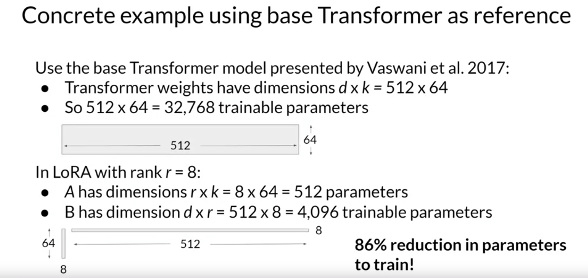

# Week 2

## Instruction fine-tuning

Limitations for in-context learning

- May not always work for smaller models
- Examples take up context window space

Instead we can use fine-tuning which is a **supervised learning** process where you use
a data set of labeled examples to update the weights of the LLM.

Instruction fine-tuning where **all** of the model's weights are updated is known as
**full fine-tuning**.

Just like pre-training, full fine tuning requires enough memory and compute budget to
store and process all the gradients, optimizers and other components that are being
updated during training.

The fine-tuning process results in a new version of the base model, often called an
**Instruct Model** that is better at the tasks you are interested in. Fine-tuning with
instruction prompts is the most common way to fine-tune LLMs these days.

## Fine-tuning on a single task

A potential downside to fine-tuning on a single task is that the process may lead to a
phenomenon called **catastrophic forgetting**. Catastrophic forgetting happens because
the full fine-tuning process modifies the weights of the original LLM. This leads to
great performance on the single fine-tuned task, but it can degrade performance on other
tasks.

If we care about preserving generalized performance, some potential ways to mitigate
are:

- Fine-tune on multiple tasks at the same time
- Consider Parameter Efficient Fine-tuning (PEFT)

One way to mitigate catastrophic forgetting is by using regularization techniques to
limit the amount of change that can be made to the weights of the model during training.
This can help to preserve the information learned during earlier training phases and
prevent overfitting to the new data.

## Multi-task instruction fine-tuning

In multi-task instruction fine-tuning, you train the model on a mixed dataset so that it
can improve its performance on all the tasks simultaneously, thus avoiding the issue of
catastrophic forgetting.

FLAN (Fine-tuned LAnguage Net) models refer to a specific set of instructions used to
perform instruction fine-tuning.

FLAN-T5 is the FLAN-instruct version of the T5 foundation model.

## Scaling instruct models

[Scaling Instruction-Finetuned Language Models](./supplemental/scaling-instruction-finetuned-language-models.pdf)

## Model Evaluation

Traditional machine learning can be evaluated more simply because the models are deterministic:

$$
\text{Accuracy} = \frac{\text{Correct predictions}}{\text{Total predictions}}
$$

In LLM's, evaluation is much more challenging because the models are non-deterministic. For example,
consider the sentences

"Mike really loves drinking tea" vs "Mike adores sipping tea" which both have similar meaning, but
whose sentence structure is different.

And "Mike does not drink coffee" vs "Mike does drink coffee" which have only a 1 word difference,
but completely different meaning.

LLM evaluation metrics

**[ROUGE](https://en.wikipedia.org/wiki/ROUGE_(metric))**

- Used for text summarization
- Compares a summary to one ore more reference summaries

**[BLEU](https://en.wikipedia.org/wiki/BLEU)**

- Used for text translation
- Compares to human-generated translations

---

- Unigram: single word
- Bigram: 2 words
- N-gram: n words

$$
\text{ROUGE-1 Recall} = \frac{\text{unigram matches}}{\text{unigrams in reference}}
$$

$$
\text{ROUGE-1 Precision} = \frac{\text{unigram matches}}{\text{unigrams in output}}
$$

$$
\text{ROUGE-1 F1} = \frac{\text{precision } \cdot \text{ recall}}{\text{precision } + \text{ recall}}
$$

F1 score is the [harmonic mean](https://en.wikipedia.org/wiki/Harmonic_mean) of precision and recall.

---

$$
\text{ROUGE-2 Recall} = \frac{\text{bigram matches}}{\text{bigrams in reference}}
$$

$$
\text{ROUGE-2 Precision} = \frac{\text{bigram matches}}{\text{bigrams in output}}
$$

$$
\text{ROUGE-2 F1} = 2 \cdot \frac{\text{precision } \cdot \text{ recall}}{\text{precision } + \text{ recall}}
$$

---

ROUGE-L - Longest common subsequence (LCS) score

$$
\text{ROUGE-L Recall} = \frac{\text{LCS(Gen, Ref)}}{\text{unigrams in reference}}
$$

$$
\text{ROUGE-L Precision} = \frac{\text{LCS(Gen, Ref)}}{\text{unigrams in output}}
$$

$$
\text{ROUGE-L F1} = 2 \cdot \frac{\text{precision } \cdot \text{ recall}}{\text{precision } + \text{ recall}}
$$

---

$$
\text{BLEU metric} = \text{Avg(precision across range of n-gram sizes)}
$$

## Benchmarks

- GLUE (General Language Understanding Evaluation)
- SuperGLUE
- HELM (Holistic Evaluation of Language Models)
- MMLU (Massive Multitask Language Understanding)
- BIG-bench

## Parameter Efficient Fine-Tuning (PEFT)

Fine-tuning LLM's is challenging. Need memory for:

- Trainable weights
- Optimizer states
- Gradients
- Forward activations
- Temp memory

It is common to need 12-20x weight memory for non-weight parameters.

PEFT only updates a small set of parameters. Freeze most weights and focus on a subset.

Some techniques don't touch any of the original parameters and instead add new trainable layers
and only fine-tune those components.

In some cases PEFT only requires 15-20% of the original weights and can be performed on a single
GPU.

PEFT is less prone to catastrophic forgetting (since it only touches a small subset of the weights).

PEFT methods

- **Selective**: select subset of initial LLM parameters to fine-tune
- **Re-parameterize**: re-parameterize model weights using a low-rank representation (e.g. LoRA)
- **Additive**: Add trainable layers or parameters to model
    - Adapters
    - Soft prompts (e.g. prompt tuning)

## PEFT-techniques: LoRA

LoRA: Low Rank Adaptation of LLM's falls into the re-parameterization category.

1. Freeze most of the original LLM weights
2. Inject 2 rank decomposition matrices
3. Train the weights of the smaller matrices

To update model for inference:

1. Matrix multiply the low rank matrices
2. Add to original weights

In practice LoRA is usually applied to weights in the self-attention layers.

The memory required to store these LoRA matrices is very small. So in principle, you can use LoRA
to train for many tasks. Switch out the weights when you need to use them, and avoid having to
store multiple full-size versions of the LLM.

## PEFT-techniques: Soft prompts

Prompt tuning is not prompt engineering! Prompt tuning adds trainable "soft prompt" to inputs.

With prompt tuning, you add additional trainable tokens to your prompt and leave it up to the
supervised learning process to determine their optimal values.

The set of trainable tokens is called a **soft prompt**, and it gets prepended to embedding
vectors that represent your input text.

The soft prompt vectors have the same length as the embedding vectors of the language tokens. And
including somewhere between 20 and 100 virtual tokens can be sufficient for good performance.

Parameter Efficient Fine-Tuning (PEFT) methods specifically attempt to address some of the
challenges of performing full fine-training.  This includes:

Storage requirements: with PEFT, we can change just a small amount of parameters when fine-tuning,
so during inference you can combine the original model with the new parameters, instead of
duplicating the entire model for each new task you want to perform fine-tuning.

Computational constraints: because most parameters are frozen, we typically only need to train
15%-20% of the original LLM weights, making the training process less expensive (less memory
required)
