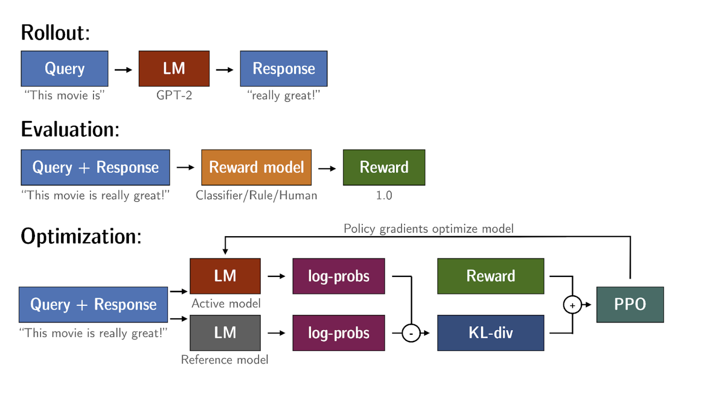
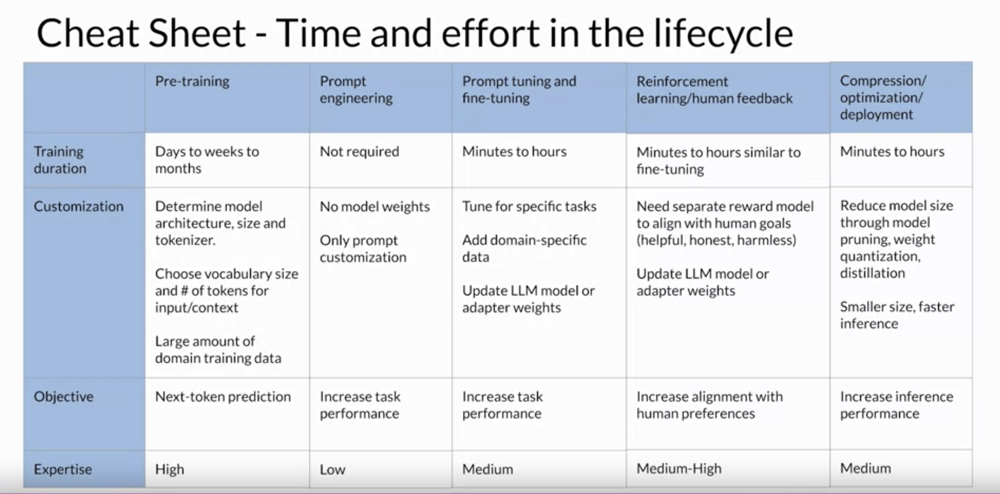
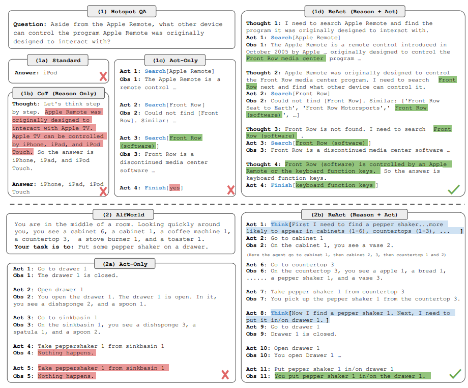
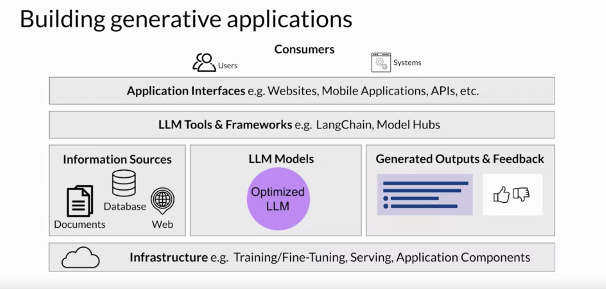

# Week 3

## Aligning models with human values

Are LLM completions
  - Helpful
  - Honest
  - Harmless

These 3 qualities are often abbreviated HHH.

## Reinforcement Learning from Human Feedback (RLHF)

- Maximize helpfulness
- Minimize Harmless
- Avoid dangerous topics

Reinforcement learning is a type of machine learning in which an agent learns to make decisions
related to a specific goal by taking actions in an environment, with the objective of maximizing
some notion of a cumulative reward.

As the agent takes actions, it collects rewards based on the actions' effectiveness in progressing
towards a win. The goal of reinforcement learning is for the agent to learn the optimal policy for
a given environment that maximizes their rewards.

## RLHF: Obtaining feedback from humans

[Transcript](./transcripts/04-obtaining-feedback-from-humans.txt)

## RLHF: Reward model

[Transcript](./transcripts/05-reward-model.txt)

## RLHF: Fine-tuning with reinforcement learning

PPO: Proximal Policy Optimization

## Proximal policy optimization

PPO optimizes a policy, in this case the LLM, to be more aligned with human preferences.

## RLHF: Reward hacking

You can compare the two completions and calculate a value called the Kullback-Leibler divergence,
or KL divergence for short. KL divergence is a statistical measure of how different two probability
distributions are. You can use it to compare the completions of the two models and determine how
much the updated model has diverged from the reference

## KL divergence

KL-Divergence, or Kullback-Leibler Divergence, is a concept often encountered in the field of
reinforcement learning, particularly when using the Proximal Policy Optimization (PPO) algorithm.
It is a mathematical measure of the difference between two probability distributions, which helps
us understand how one distribution differs from another. In the context of PPO, KL-Divergence plays
a crucial role in guiding the optimization process to ensure that the updated policy does not
deviate too much from the original policy.

In PPO, the goal is to find an improved policy for an agent by iteratively updating its parameters
based on the rewards received from interacting with the environment. However, updating the policy
too aggressively can lead to unstable learning or drastic policy changes. To address this, PPO
introduces a constraint that limits the extent of policy updates. This constraint is enforced by
using KL-Divergence.

To understand how KL-Divergence works, imagine we have two probability distributions: the
distribution of the original LLM, and a new proposed distribution of an RL-updated LLM.
KL-Divergence measures the average amount of information gained when we use the original policy to
encode samples from the new proposed policy. By minimizing the KL-Divergence between the two
distributions, PPO ensures that the updated policy stays close to the original policy, preventing
drastic changes that may negatively impact the learning process.

A library that you can use to train transformer language models with reinforcement learning, using
techniques such as PPO, is TRL (Transformer Reinforcement Learning). In
[this link](https://huggingface.co/blog/trl-peft) you can read more about this library, and its
integration with PEFT (Parameter-Efficient Fine-Tuning) methods, such as LoRA (Low-Rank Adaption).
The image shows an overview of the PPO training setup in TRL.

## Scaling human feedback

Although you can use a reward model to eliminate the need for human evaluation during RLHF fine
tuning, the human effort required to produce the trained reward model in the first place is huge.
The labeled data set used to train the reward model typically requires large teams of labelers,
sometimes many thousands of people to evaluate many prompts each. This work requires a lot of time
and other resources which can be important limiting factors.

Model self-supervision: Constitutional AI

## Model optimizations for deployment

LLM optimization techniques

### Distillation

Model Distillation is a technique that focuses on having a larger teacher model train a smaller
student model.

The key benefit of distillation methods is that the smaller student model can be used for inference
in deployment instead of the teacher model. In practice, distillation is not as effective for
generative decoder models. It's typically more effective for encoder only models, such as Burt that
have a lot of representation redundancy.

### Post-training quantization (PTQ)

After a model is trained, you can perform post training quantization, or PTQ for short to optimize
it for deployment. PTQ transforms a model's weights to a lower precision representation, such as
16-bit floating point or 8-bit integer. To reduce the model size and memory footprint, as well as
the compute resources needed for model serving, quantization can be applied to just the model
weights or to both weights and activation layers.

### Pruning

At a high level, the goal is to reduce model size for inference by eliminating weights that are not
contributing much to overall model performance. These are the weights with values very close to or
equal to zero. Note that some pruning methods require full retraining of the model, while others
fall into the category of parameter efficient fine tuning, such as LoRA.

## Generative AI project lifecycle cheat sheet

## Using the LLM in applications

The internal knowledge held by a model cuts off at the moment of pre-training.

Retrieval Augmented Generation, or RAG for short, is a framework for building LLM powered systems
that make use of external data sources.

RAG is useful in any case where you want the language model to have access to data that it may not
have seen.

## Interacting with external applications

In general, connecting LLMs to external applications allows the model to interact with the broader
world, extending their utility beyond language tasks.

It's important to note that prompts and completions are at the very heart of these workflows. The
actions that the app will take in response to user requests will be determined by the LLM, which
serves as the application's reasoning engine. In order to trigger actions,

## Helping LLMs reasons and plan with chain-of-thought

Intermediate calculations form the reasoning steps that a human might take during problem solving.

The full sequence of steps illustrates the chain of thought that went into solving the problem.
Asking a model to mimic this behavior is known as chain of thought prompting. It works by
including a series of intermediate reasoning steps into any examples that you use for one or few-
shot inference. By structuring the examples in this way, you're essentially teaching the model
how to reason through the task to reach a solution.

## Program-aided language models (PAL)

The strategy behind PAL is to have the LLM generate completions where reasoning steps are
accompanied by computer code. This code is then passed to an interpreter to carry out the
calculations necessary to solve the problem. You specify the output format for the model by
including examples for one or few short inference in the prompt.

## ReAct: combining reasoning and action

ReAct is a prompting strategy that combines chain of thought reasoning with action planning.
The ReAct framework shows one way to use LLMs to power an application through reasoning and
action planning. This strategy can be extended for your specific use case by creating examples
that work through the decisions and actions that will take place in your application. Thankfully,
frameworks for developing applications powered by language models are in active development. One
solution that is being widely adopted is called LangChain, the LangChain framework provides you
with modular pieces that contain the components necessary to work with LLMs.

## ReAct: reasoning and action

[This paper](supplemental/react-synergizing-reasoning-and-acting-in-language-models.pdf)
introduces ReAct, a novel approach that integrates verbal reasoning and interactive decision
making in large language models (LLMs). While LLMs have excelled in language understanding and
decision making, the combination of reasoning and acting has been neglected. ReAct enables LLMs
to generate reasoning traces and task-specific actions, leveraging the synergy between them. The
approach demonstrates superior performance over baselines in various tasks, overcoming issues
like hallucination and error propagation. ReAct outperforms imitation and reinforcement learning
methods in interactive decision making, even with minimal context examples. It not only enhances
performance but also improves interpretability, trustworthiness, and diagnosability by allowing
humans to distinguish between internal knowledge and external information.

In summary, ReAct bridges the gap between reasoning and acting in LLMs, yielding remarkable
results across language reasoning and decision making tasks. By interleaving reasoning traces and
actions, ReAct overcomes limitations and outperforms baselines, not only enhancing model
performance but also providing interpretability and trustworthiness, empowering users to
understand the model's decision-making process.

The figure provides a comprehensive visual comparison of different prompting methods in two
distinct domains. The first part of the figure (1a) presents a comparison of four prompting
methods: Standard, Chain-of-thought (CoT, Reason Only), Act-only, and ReAct (Reason+Act) for
solving a HotpotQA question. Each method's approach is demonstrated through task-solving
trajectories generated by the model (Act, Thought) and the environment (Obs). The second part of
the figure (1b) focuses on a comparison between Act-only and ReAct prompting methods to solve an
AlfWorld game. In both domains, in-context examples are omitted from the prompt, highlighting the
generated trajectories as a result of the model's actions and thoughts and the observations made
in the environment. This visual representation enables a clear understanding of the differences
and advantages offered by the ReAct paradigm compared to other prompting methods in diverse
task-solving scenarios.

## LLM application architectures

## AWS SageMaker JumpStart

[SageMaker JumpStart](https://docs.aws.amazon.com/sagemaker/latest/dg/studio-jumpstart.html)
